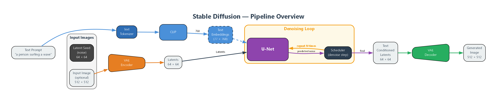
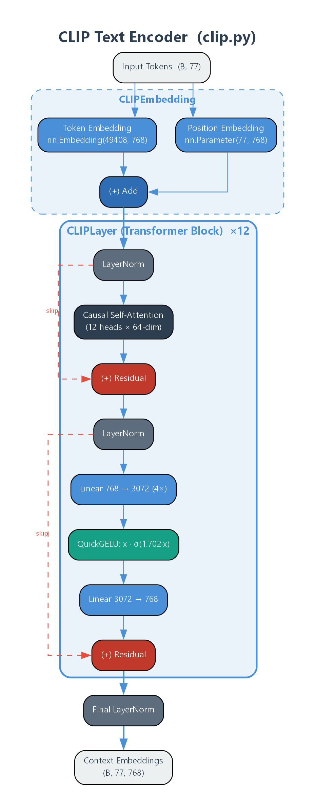
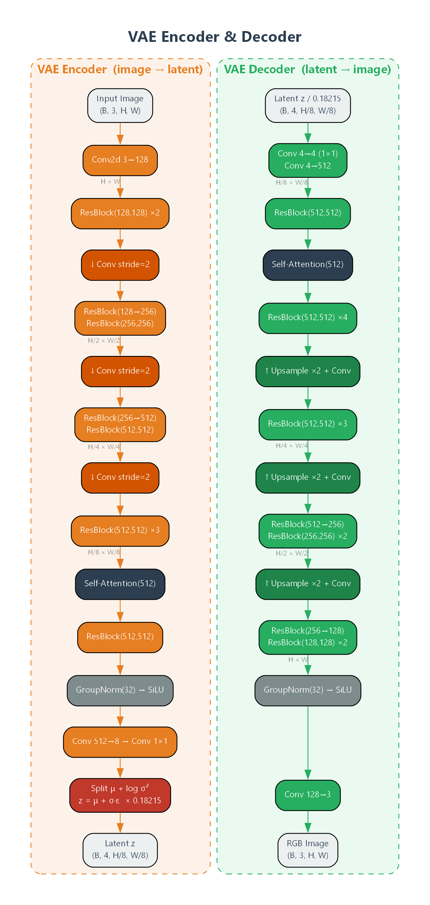
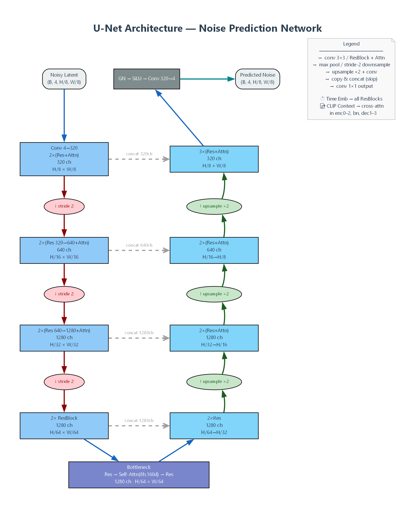
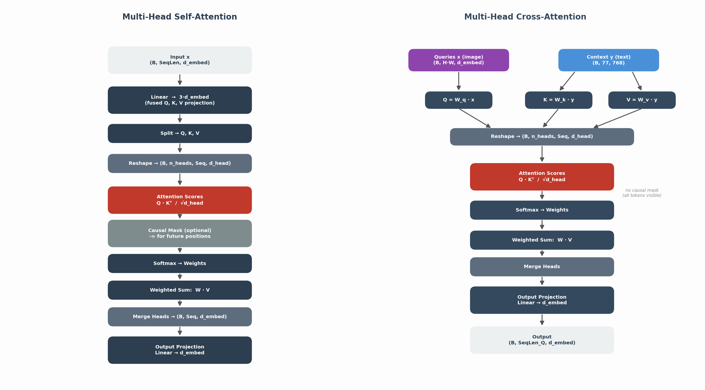
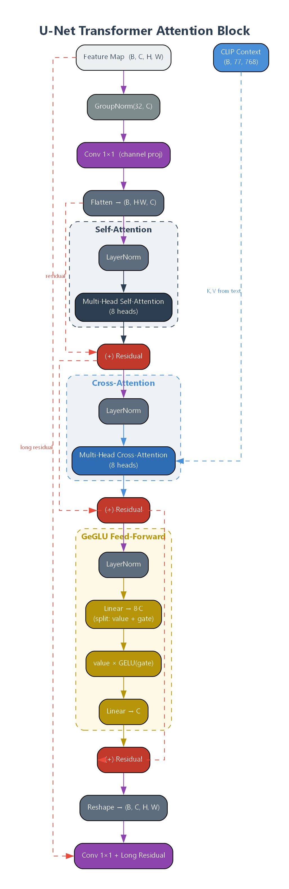
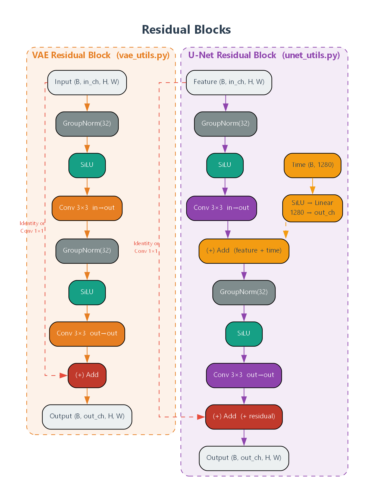

# Stable Diffusion — Pure Python Implementation

A from-scratch implementation of the **Stable Diffusion v1** architecture using only Python and PyTorch. Every component — VAE, CLIP text encoder, U-Net, and attention mechanisms — is implemented explicitly module by module for educational purposes.

This code is based on the amazing work of [Stable Diffusion from scratch](https://github.com/hkproj/pytorch-stable-diffusion) by [Umar Jamil](https://github.com/hkproj)


### Install with uv

Clone the repository and install with uv:

```bash
git clone https://github.com/ajtudela/stable_diffusion_pytorch.git
cd stable_diffusion_pytorch
uv venv --system-site-packages
uv sync
```

> [!NOTE]
> Depending on your device you must use the extras for CUDA:
> ```bash
> uv sync --extra cuda13
> ```
> If you still have some problem about torch, CUDA or the version of the package, try [clearing the cache](https://docs.astral.sh/uv/concepts/cache/#clearing-the-cache) by
> - `uv cache prune` (removes all unused cache)
> - `uv cache clean torch` (removes all cache entries for the `torch` package)
> - `uv cache clean` (removes all cache)
---

## Download weights and tokenizer files:

1. Download `vocab.json` and `merges.txt` from [stable-diffusion-v1-5](https://huggingface.co/stable-diffusion-v1-5/stable-diffusion-v1-5/tree/main/tokenizer) and save them in the `data` folder.
2. Download `v1-5-pruned-emaonly.ckpt` from [stable-diffusion-v1-5](https://huggingface.co/stable-diffusion-v1-5/stable-diffusion-v1-5/tree/main) and save it in the `data` folder.


## High-Level Pipeline

The full Stable Diffusion pipeline connects three main models: a **CLIP text encoder** that converts the prompt into embeddings, a **VAE** that maps between pixel space and a compressed latent space, and a **U-Net** that iteratively denoises latents conditioned on text and time-step.



---

## Architecture Details

### 1. CLIP Text Encoder

Encodes a text prompt into a sequence of 77 context vectors of dimension 768 that condition the U-Net at every attention layer. Uses 12 stacked transformer blocks with causal self-attention and a QuickGELU activation.



---

### 2. VAE Encoder & Decoder

The **VAE Encoder** compresses a `(B, 3, H, W)` RGB image into a `(B, 4, H/8, W/8)` latent using progressive downsampling and the reparameterization trick. The **VAE Decoder** mirrors the encoder, upsampling the latent back to a full-resolution RGB image.



---

### 3. U-Net (Noise Prediction Network)

The core of the diffusion model. An encoder-bottleneck-decoder structure with **skip connections** between matching encoder and decoder stages. Features are conditioned on both the **text context** (via cross-attention) and the **time-step** (via additive embeddings in residual blocks).



---

### 4. Attention Mechanisms

Two attention modules drive all information exchange in the architecture:

- **Self-Attention** — every position attends to every other position in the same sequence (used in CLIP, VAE bottleneck, and U-Net spatial layers).
- **Cross-Attention** — queries come from image features, keys/values from CLIP text embeddings. This is how the text prompt steers generation.



---

### 5. U-Net Transformer Attention Block

Each attention layer in the U-Net applies three sub-blocks in sequence, each with its own pre-norm residual connection: Self-Attention → Cross-Attention → GeGLU Feed-Forward.



---

### 6. Residual Blocks

The **VAE Residual Block** applies GroupNorm → SiLU → Conv with a skip connection. The **U-Net Residual Block** adds time-step conditioning: the 1280-dim time embedding is projected and added to the feature map between the two convolutions.



---

### 7. Channel & Resolution Summary

| Stage | Spatial Resolution | VAE Encoder | U-Net Encoder | U-Net Decoder | VAE Decoder |
| :---: | :----------------: | :---------: | :-----------: | :-----------: | :---------: |
|   0   |       H × W        |   128 ch    |       —       |       —       |   128 ch    |
|   1   |     H/2 × W/2      |   256 ch    |       —       |       —       |   256 ch    |
|   2   |     H/4 × W/4      |   512 ch    |       —       |       —       |   512 ch    |
|   3   |     H/8 × W/8      | 512 → 8 → 4 |    320 ch     |    320 ch     |   4 → 512   |
|   4   |    H/16 × W/16     |      —      |    640 ch     |    640 ch     |      —      |
|   5   |    H/32 × W/32     |      —      |    1280 ch    |    1280 ch    |      —      |
|   6   |    H/64 × W/64     |      —      |    1280 ch    |    1280 ch    |      —      |

---

## Key Concepts

| Concept                       | Description                                                                                           |
| ----------------------------- | ----------------------------------------------------------------------------------------------------- |
| **Latent Diffusion**          | Operates in a compressed latent space (4ch, H/8×W/8) instead of pixel space, reducing compute by ~64× |
| **Reparameterization Trick**  | z = μ + σ · ε — enables backpropagation through stochastic sampling                                   |
| **Classifier-Free Guidance**  | Interpolates between conditional and unconditional predictions: ε̂ = ε_u + s · (ε_c − ε_u)             |
| **Cross-Attention**           | Injects text conditioning into U-Net: queries from image features, keys/values from CLIP embeddings   |
| **GeGLU**                     | Gated activation: GeGLU(x) = x₁ ⊙ GELU(x₂) — used in U-Net feed-forward blocks                        |
| **Sinusoidal Time Embedding** | Encodes diffusion time-step as a 320-dim vector, expanded to 1280 via MLP                             |
| **Skip Connections**          | U-Net concatenates encoder features with decoder features at matching resolutions                     |

---

## Regenerate Diagrams

All architecture diagrams are generated with [Graphviz](https://graphviz.org/) via the Python `graphviz` package. To regenerate them:

1. Install Graphviz system binary ([download](https://graphviz.org/download/)) and make sure `dot` is on your PATH.
2. Install the Python package: `pip install graphviz`
3. Run:

```bash
python scripts/generate_diagrams.py
```